# Community

For SDC admins. Community holds everyone who gets SDC emails and shows where each person is in their journey. **General members** is everyone who isn't a paying member. **Paying members** is everyone with paid benefits. Each person is in one tab, never both. Each email address is one person.

## What each status means
Every person has one status in the **Status** column:
- **Invited**: they joined but haven't started setting up their preferences.
- **Onboarding incomplete**: they started setting up but didn't finish.
- **Active**: they clicked an opportunity's main button (signed up or took action) in the last 60 days.
- **Inactive**: they haven't clicked an opportunity's main button in the last 60 days, including people who never have.
- **Unsubscribed**: they don't get emails.

Opening an email doesn't count, and neither does sharing an opportunity with a friend.

## Find someone

<figure>
  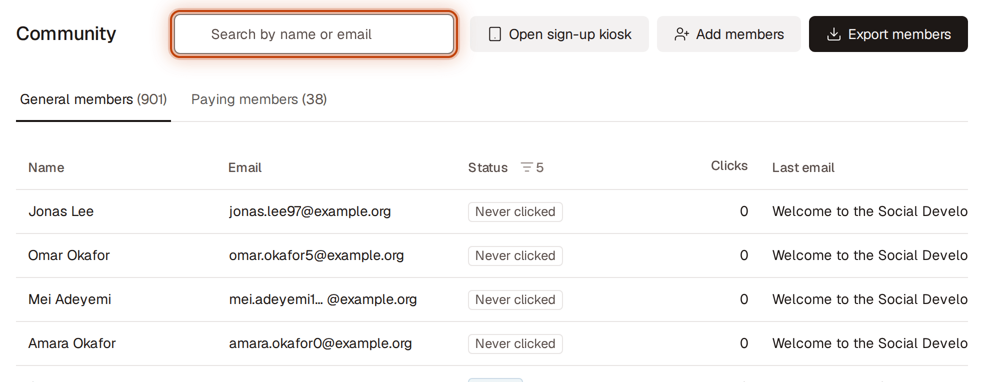
  <figcaption>Figure 1. Find someone</figcaption>
</figure>

1. Go to **Community** and choose **General members** or **Paying members**.
2. Type a name or email in **Search by name or email**, next to the page title. Results update as you type. Click the **×** to clear it.

Long names, emails and subjects end in "…". Point at a name or a **Last email** subject to see all of it; click an email to copy the whole address.

If nobody matches but someone with a hidden status does (for example, they unsubscribed), the page says so. Click **Show all statuses** to see them.

## Filter by status

<figure>
  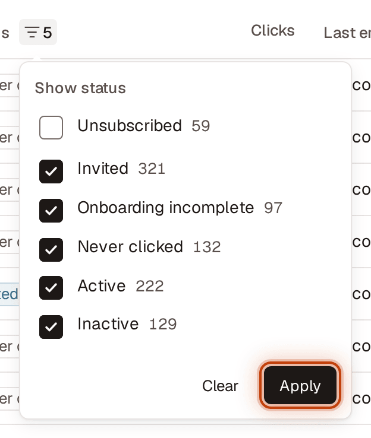
  <figcaption>Figure 2. Filter by status</figcaption>
</figure>

1. Click the filter icon next to **Status** in the table header.
2. Check the statuses you want to see. Each shows how many people have it. Click **Apply** to filter the list. To go back, click **Clear**, then **Apply**.

Unsubscribed people are hidden until you check **Unsubscribed**. The tab counts and the list follow your choice, and it stays while you search, sort, switch tabs and change pages.

## Sort the list

<figure>
  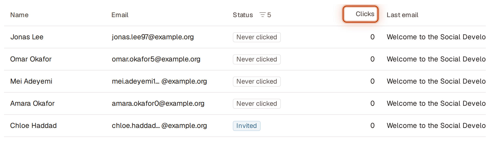
  <figcaption>Figure 3. Sort the list</figcaption>
</figure>

1. Select a column header: **Name**, **Email**, **Clicks** or **Sent**. The list starts with the newest people first.
2. Select the same header again to reverse the order. An arrow beside the header shows the current order.
3. Changing the order takes you back to the first page. While the list reloads, the current rows stay dimmed and the arrow turns into a spinner.

**Clicks** counts every time the person clicked an opportunity's main button. **Last email** shows the subject of the most recent email they were sent, and **Sent** shows how long ago it went out. Point at the time to see the full date. On a narrow screen, scroll the table sideways; the name and email stay in place.

## Copy someone's email

<figure>
  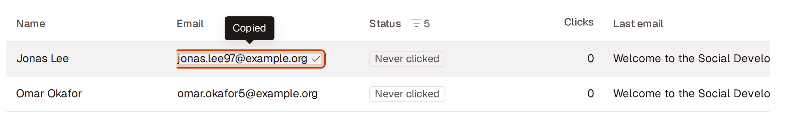
  <figcaption>Figure 4. Copy someone's email</figcaption>
</figure>

Click their email, in the table or at the top of their panel. The icon beside it turns into a check and "Copied" shows for a moment.

## Add someone

<figure>
  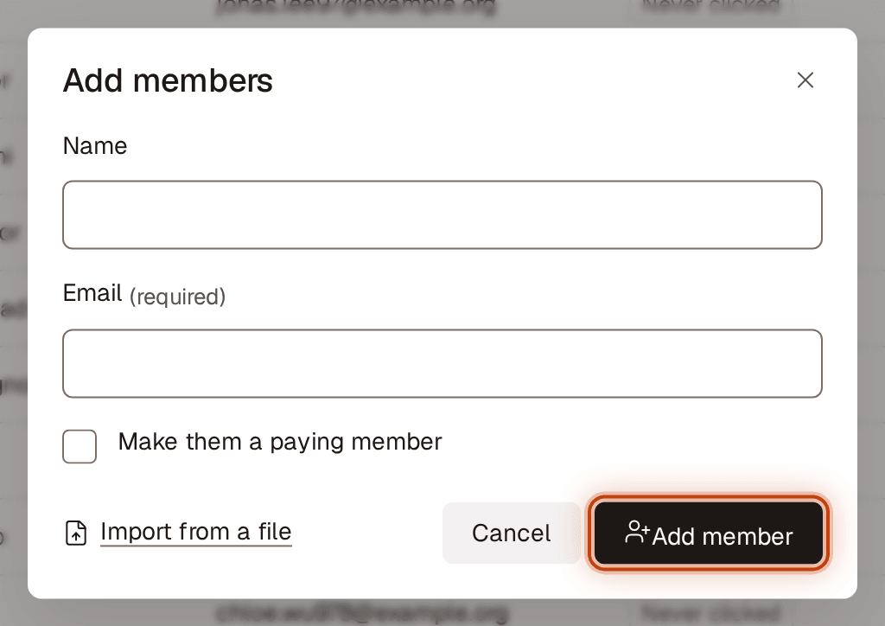
  <figcaption>Figure 5. Add someone</figcaption>
</figure>

1. Click **Add members** (the person-with-a-plus icon at the top right; point at it to see its name).
2. Enter their **Name** (optional) and **Email**.
3. To give them paid benefits, check **Make them a paying member**.
4. Click **Add member**.

They get the matching welcome email and show as **Invited** until they set up their preferences. If they're already in Community, unsubscribed or were deleted, you'll see a preview of what will happen instead (see [Check the preview](#check-the-preview)).

## Import people from a file

<figure>
  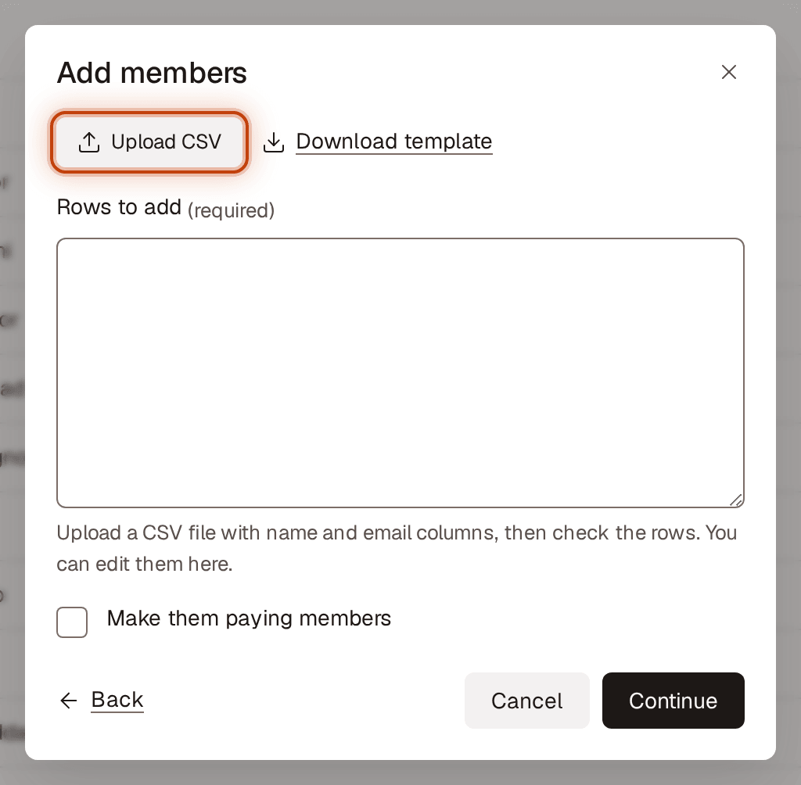
  <figcaption>Figure 6. Import people from a file</figcaption>
</figure>

1. Click **Add members**, then **Import from a file**.
2. Click **Choose a CSV file** (or drag the file onto it). Your CSV needs a **name** and an **email** column; click **Download template** if you need one. To type or paste people instead, click **Paste rows instead**.
3. The rows appear in **People to add**, one person per line, so you can check and edit them. Click **Add another file** to add more.
4. To make everyone on the list paying members, check **Make them paying members**.
5. Click **Continue** and read the preview. To go back to adding one person, click **Back**.

## Check the preview

<figure>
  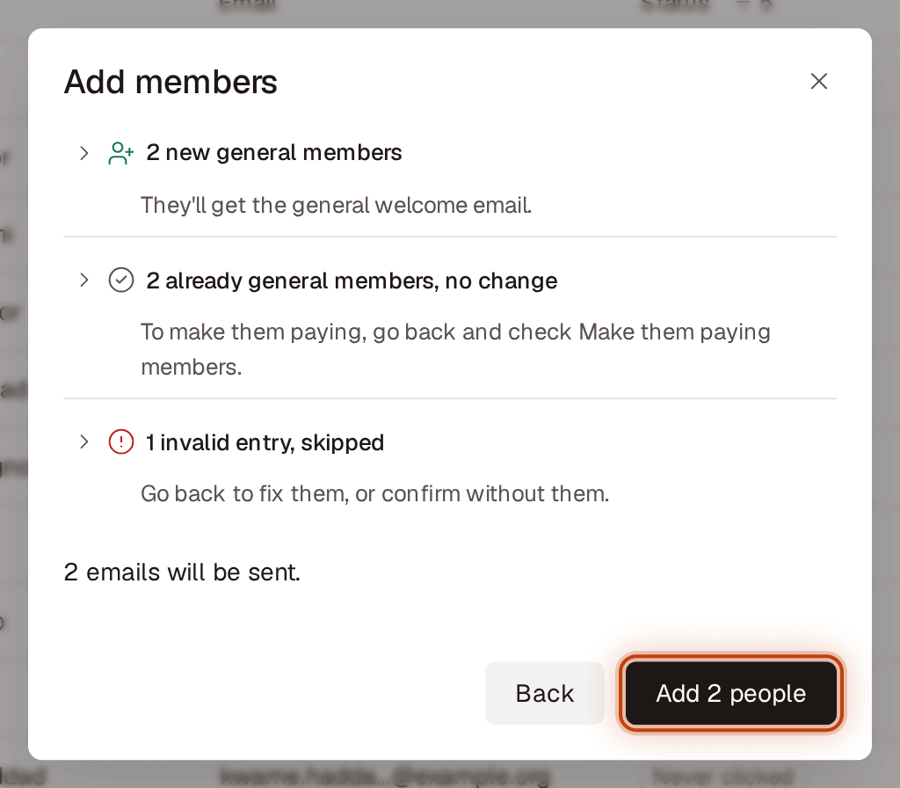
  <figcaption>Figure 7. Check the preview</figcaption>
</figure>

Nothing is saved or sent until you confirm. The preview groups every address by what will happen; click a group to see its addresses:
- **new general members** or **new paying members**: they're added and get the matching welcome email.
- **general members will become paying**: they get the Paying membership added email.
- **already paying, no change**: paying members are never moved to general.
- **already general members, no change**: to make them paying, click **Back** and check the paying box.
- **entered more than once, merged**: each person is handled once.
- **invalid entries, skipped**: click **Back** to fix them, or confirm without them.
- **unsubscribed themselves, not resubscribed**: only they can resubscribe. If you checked the paying box, they still become paying members, without an email.
- **unsubscribed by an admin**: they stay unsubscribed unless you check **Resubscribe N people an admin unsubscribed**.
- **deleted earlier, skipped**: they were deleted from Community. Only they can sign up again.

Below the groups you'll see how many emails will be sent. The main button says what it does: **Add N people**, **Make N people paying**, **Resubscribe N people**, or **Confirm N changes** for a mix. If nothing would change, click **Edit list** to fix the list, or **Close**.

## Sign people up at a booth

<figure>
  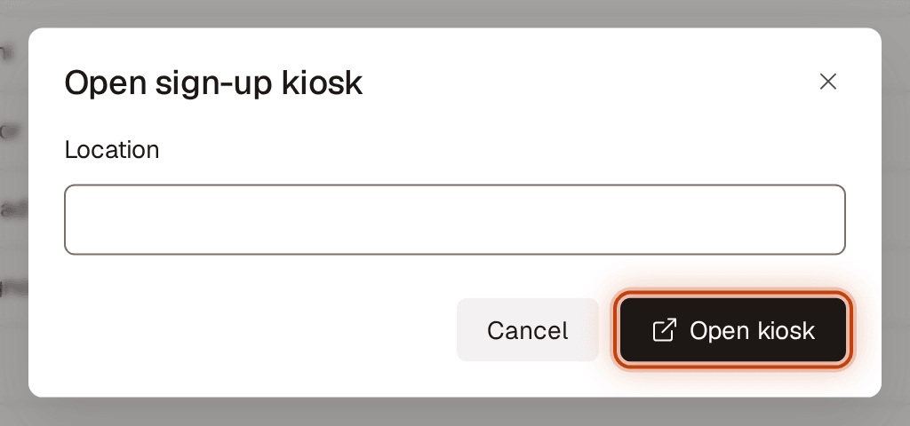
  <figcaption>Figure 8. Sign people up at a booth</figcaption>
</figure>

1. Click **Open sign-up kiosk** (the tablet icon at the top right).
2. Optionally, under **Location**, type where the booth is. It's saved with each sign-up and shows in the Members export; visitors don't see it.
3. Click **Open kiosk**. The sign-up page opens in a new tab; hand the tablet to visitors. To close without opening it, click **Cancel**.

People who sign up become general members and show as **Invited**. After each sign-up the screen turns green with "You're in, {first name}!" and starts over after 20 seconds, or when they tap **Next person**. Someone already in Community sees the same thanks and nothing changes for them.

## See someone's details and emails

<figure>
  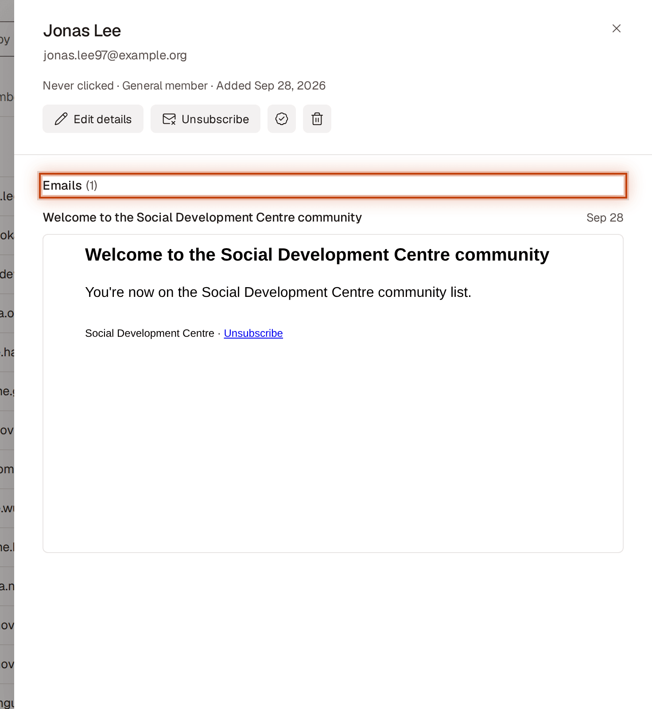
  <figcaption>Figure 9. See someone's details and emails</figcaption>
</figure>

1. Click the person's row. Their panel shows their name, email and a line such as "Active · General member · Added Apr 11, 2026".
2. Scroll to **Emails**. It lists every email they were sent, newest first. Under each opportunities email you'll see what they did, such as "Signed up: Film night · Shared: Tenant workshop", or "No clicks". An email that couldn't be delivered shows **Not delivered**; use **Edit details** to correct their address.
3. Keep scrolling to read each message. Each one loads as you reach it.

To share someone's panel with another admin, copy the page address while it's open; the link opens Community with their panel showing.

## Edit someone's name or email

<figure>
  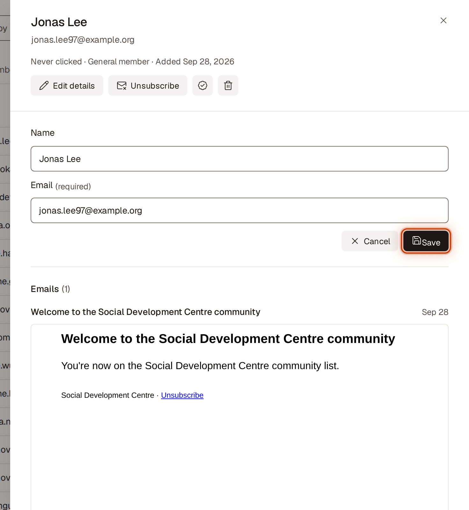
  <figcaption>Figure 10. Edit someone's name or email</figcaption>
</figure>

1. Click the person's row, then click **Edit details**.
2. Change **Name** or **Email** and click **Save** (or **Cancel** to discard).

If the email already belongs to someone else, including someone who unsubscribed, you'll be told and nothing is saved.

## Convert someone to a paying member

<figure>
  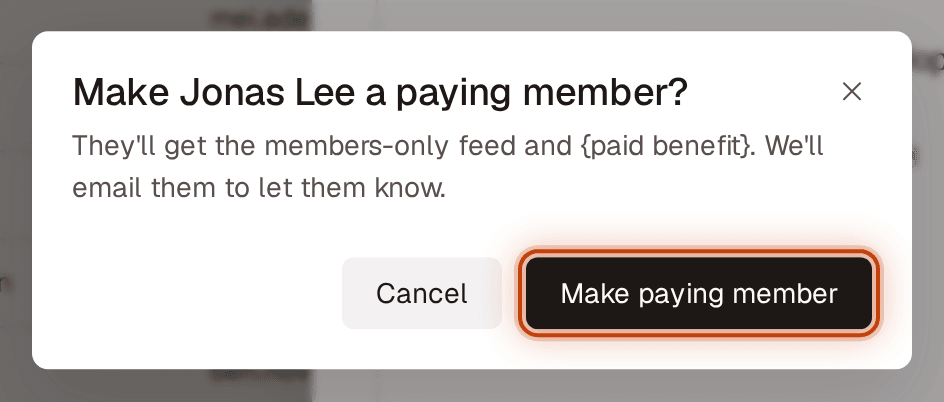
  <figcaption>Figure 11. Convert someone to a paying member</figcaption>
</figure>

1. Click the person's row, then click the **Convert to paying member** icon button (a badge with a check). Or open the row's **⋯** menu and choose **Convert to paying member**.
2. Read what they'll get and click **Make paying member**.

They move to **Paying members** and get the Paying membership added email. You'll see "Paying member email sent." once it's delivered. If they're unsubscribed, they get paying access but no email, and the message says so. You can also convert people by adding them again with **Add members** and the paying box checked.

## Remove someone's paying access

<figure>
  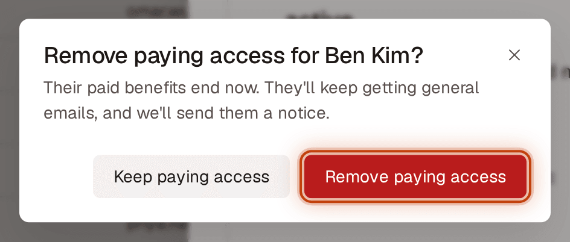
  <figcaption>Figure 12. Remove someone's paying access</figcaption>
</figure>

1. Click the person's row, then click the **Remove paying access** icon button. Or open the row's **⋯** menu and choose **Remove paying access**.
2. Click **Remove paying access** to confirm.

Their paid benefits end right away and they get the Paying access removed email (unless they're unsubscribed). They become a general member and keep getting general emails.

## Unsubscribe someone

<figure>
  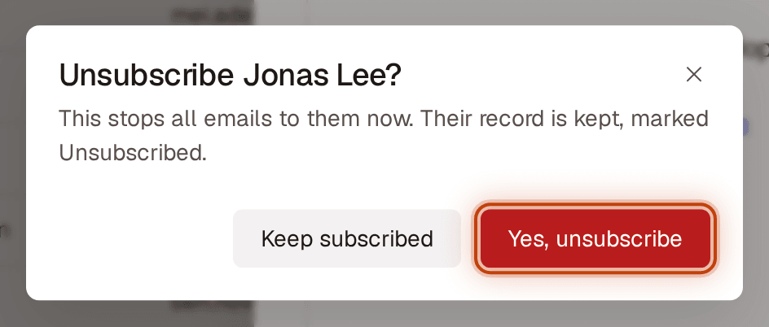
  <figcaption>Figure 13. Unsubscribe someone</figcaption>
</figure>

1. Click the person's row, then click **Unsubscribe**. Or open the row's **⋯** menu and choose **Unsubscribe**.
2. Click **Yes, unsubscribe**.

They stop getting all SDC emails. A paying member stays a paying member. Their record stays, with the status **Unsubscribed**, hidden until you show **Unsubscribed** in the Status filter.

## Resubscribe someone

<figure>
  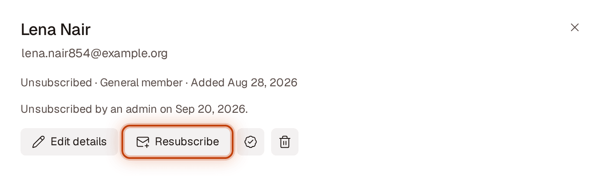
  <figcaption>Figure 14. Resubscribe someone</figcaption>
</figure>

You can resubscribe only people an admin unsubscribed. People who unsubscribed themselves can only resubscribe themselves; their panel says "Unsubscribed themselves on {date}. Only they can resubscribe."
1. In the **Status** filter, check **Unsubscribed**, then find the person.
2. Click their row, then click **Resubscribe**. Or open the row's **⋯** menu and choose **Resubscribe**.

They get SDC emails again. No welcome email is sent.

## Delete someone at their request

<figure>
  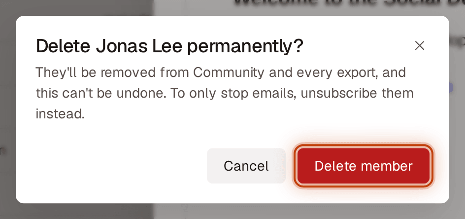
  <figcaption>Figure 15. Delete someone at their request</figcaption>
</figure>

Use this when someone asks for their data to be removed. To only stop emails, unsubscribe them instead.
1. Click the person's row, then click the **Delete member** icon button (a bin).
2. Read the warning and click **Delete member**.

They're removed from Community, every export and the email system. This can't be undone, and they can't be added again with **Add members** or a file. They can sign up again themselves.

## Export for analysis

<figure>
  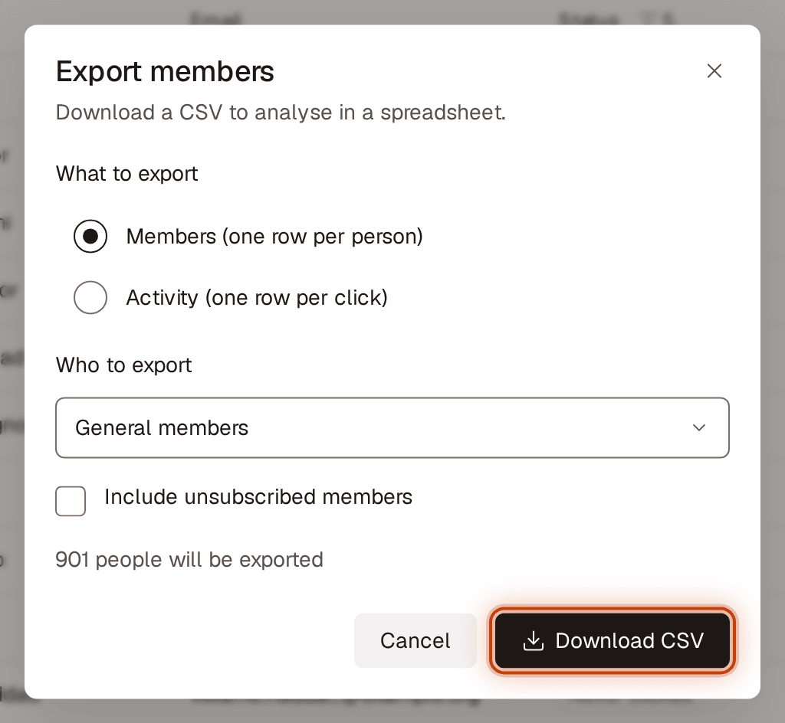
  <figcaption>Figure 16. Export for analysis</figcaption>
</figure>

1. Click **Export members**.
2. Under **What to export**, choose **Members (one row per person)** or **Activity (one row per click)**.
3. Under **Who to export**, choose **General members**, **Paying members** or **Both**. It starts on the tab you're on. Check **Include unsubscribed members** to add people who unsubscribed.
4. Check the number shown, then click **Download CSV**.

**Members** has one row per person with their status, membership, subscription, onboarding, how they joined, when they were added, their last email, emails received, clicks, sign-ups, shares and last click. **Activity** has one row for every click: the person's email, the email's subject and sent date, the opportunity, what they did (Signed up, Took action or Shared) and when.
