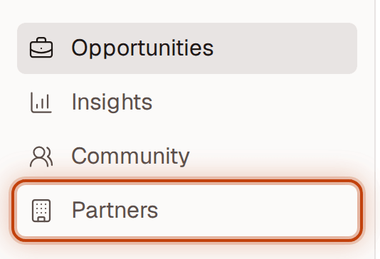
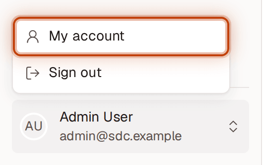
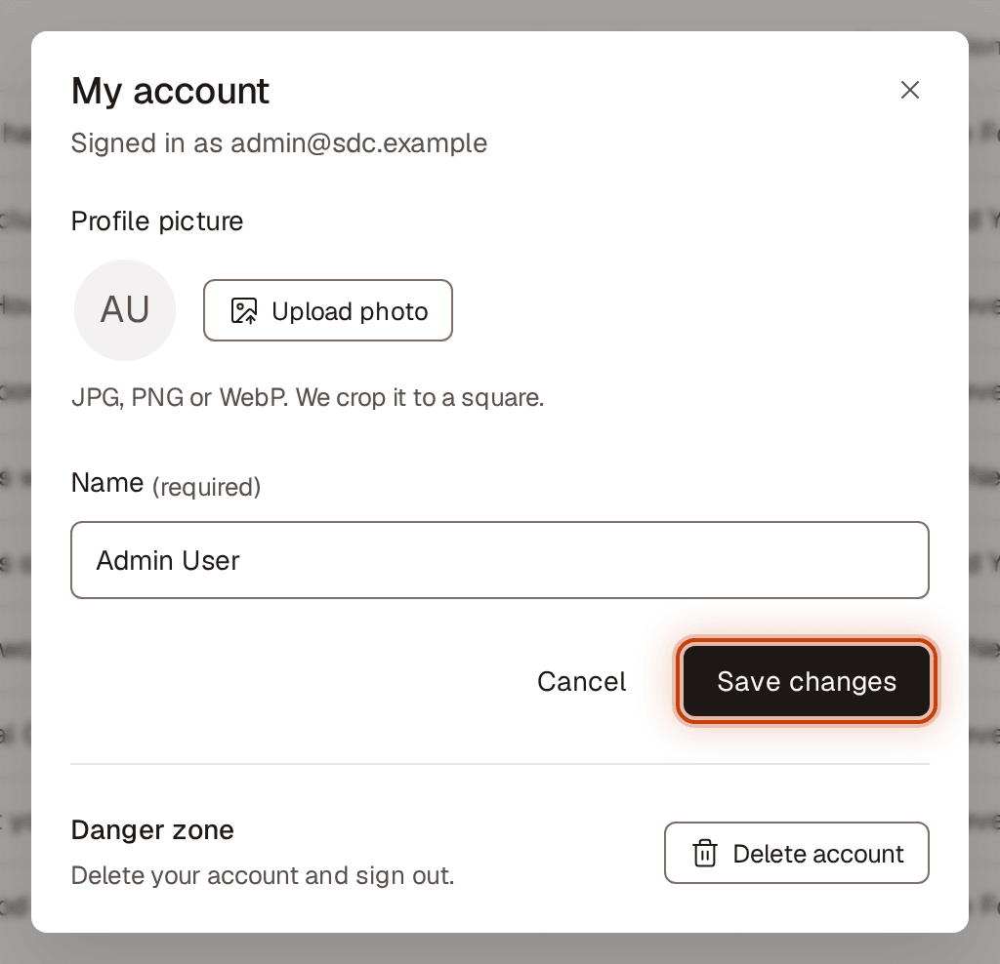
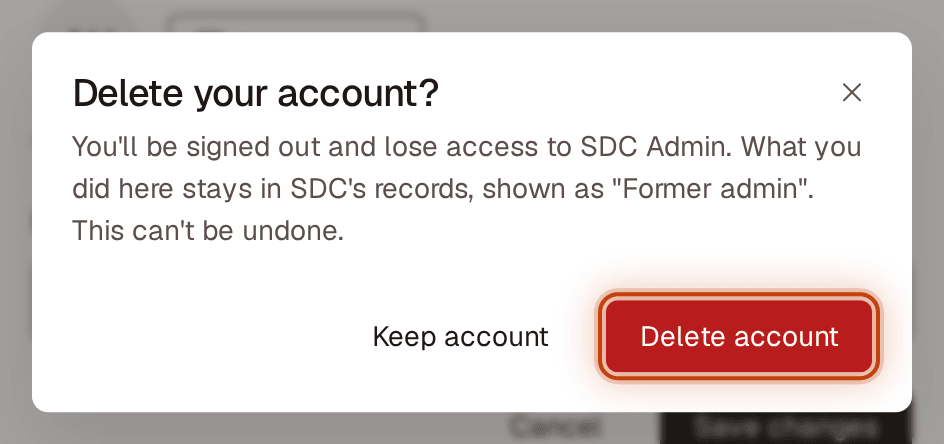

# Getting around the admin portal

For SDC admins.

## Open a section

1. Use the left sidebar: **Opportunities**, **Partners**, **Community** or **Insights**.
2. The section you're in is highlighted.

On a phone, tap the menu button (**Open menu**) at the top left to open the sidebar, then choose a section. To close it without choosing, tap the **X** (**Close menu**), tap the dimmed page beside it, or press Escape.

## Go to your account or sign out

1. Click your name at the bottom of the sidebar.
2. Choose **My account** to change your name or profile picture, or **Sign out**.

When you sign out, you go back to the sign-in page, which says **You're signed out. See you soon.**

## Change your name or profile picture

1. Click your name at the bottom of the sidebar, then choose **My account**.
2. To add or change your picture, click **Upload photo** (or **Change photo**) and choose a JPG, PNG or WebP image. It's cropped to a square. To go back to your initials, click **Remove photo**.
3. Edit **Name**.
4. Click **Save changes**. You'll see **Changes saved**.

Your email address can't be changed here yet.

## Delete your account

1. Click your name at the bottom of the sidebar, then choose **My account**.
2. Under **Danger zone**, click **Delete account**.
3. Click **Delete account** again to confirm, or **Keep account** to go back.

You're signed out and lose access right away. This can't be undone. What you did in SDC Admin stays in SDC's records, shown as "Former admin".
