# Opportunities

For SDC admins. Opportunities are what SDC and Civic Hub partners share with the community: events, petitions, volunteer roles, jobs and other asks. Each one links out to the page where people take part. SDC doesn't host registration.

You can do anything a partner can, for any organization, including posting as SDC. Partners only see and manage their own organization's listings (see [Partner portal: opportunities](./partner-opportunities.md)).

## Find an opportunity

<figure>
  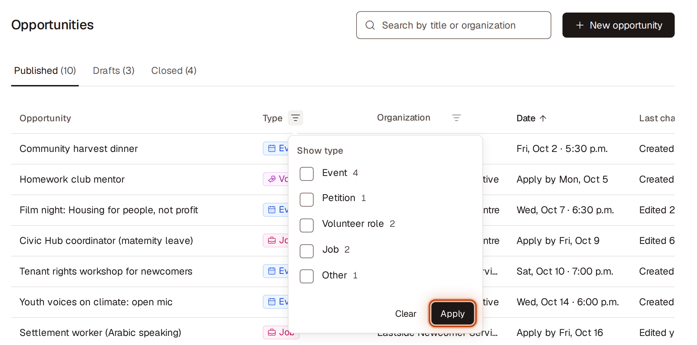
  <figcaption>Figure 1. Find an opportunity</figcaption>
</figure>

1. Go to **Opportunities**.
2. Choose a tab:
   - **Published:** members can see it now. Sorted by date, soonest first.
   - **Drafts:** not published yet. Only people who can edit it see it. Most recently updated first.
   - **Closed:** members aren't recommended or emailed it. Each one shows why: **Ended** (its date passed), **Closed** (someone closed it) or **Partner access removed** (you removed the partner's access). Most recently updated first.
3. To narrow the list:
   - Type in the search box at the top of the page. Results update as you type and match the title and the organization name.
   - To filter by type, click the filter icon next to **Type** in the table header (**Filter Type**), tick one or more types and click **Apply**. Each shows how many listings it has.
   - To filter by organization, click the filter icon next to **Organization** (**Filter Organization**), tick one or more and click **Apply**. Partners whose access you removed are listed as "{name} (removed)".
   - An active filter shows the number of choices ticked next to its icon. To remove it, open it, click **Clear**, then **Apply**.
4. To sort, click a column header: **Opportunity**, **Organization**, **Date** or **Last change**. Click it again to reverse the order. **Type** shows a colored tag with the type's name. **Last change** reads "Created …" or "Edited …". A title that doesn't fit ends in "…"; point at it to see all of it.
5. Click a row to open its details on the right. To share it, copy the page address: it opens with the same details panel open.

If nothing matches, you'll see **No matches**. Click **Clear filters** to start over.

## Post a new opportunity

<figure>
  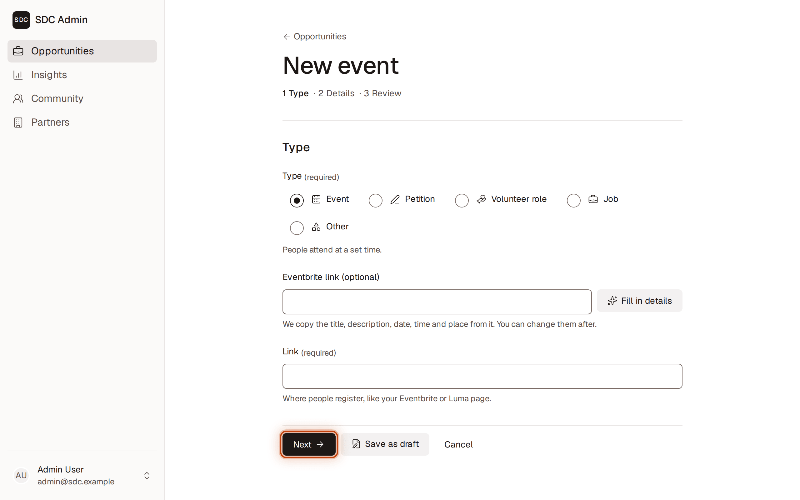
  <figcaption>Figure 2. Post a new opportunity</figcaption>
</figure>

The form has three steps, shown at the top: **1 Type · 2 Details · 3 Review**. Click **Next** and **Back** to move between them; nothing is lost. You can click **Save as draft** on any step.

1. Go to **Opportunities** and click **New opportunity** (top right).
2. **Type:** choose **Event**, **Petition**, **Volunteer role**, **Job** or **Other**.
   - **For an event on Eventbrite:** paste its address into **Eventbrite link (optional)** and click **Fill in details**. The title, short description, date, times and place are filled in for you, and the Eventbrite page becomes the **Link**. Check them on the next step.
   - **Link:** the page where people take part, like `sdckw.ca/events`. You don't need to type `https://`.
3. Click **Next**.
4. **Details:**
   - **Organization:** leave it as SDC, or choose the partner you're posting for.
   - **Title:** a few words; it's the email headline (up to 100 characters).
   - **Short description:** one or two sentences for the email (up to 280 characters).
   - **Topics:** choose 1 to 3. The count beside **Topics** shows how many you've chosen. Once you have 3, the others are unavailable; unselect one to choose another.
   - Fill in the type's own section (see [What each type asks for](#what-each-type-asks-for)).
5. Click **Next**.
6. **Review:** check how the listing will look in members' emails. Click **Edit type and link** or **Edit details** to change something.
7. Click **Publish**.

The listing is published right away, with no review by SDC. You'll see "Published. Members can now see this event." (or petition, volunteer role, and so on).

**If something is missing or wrong,** the form opens the step with the first problem. A box at the top lists each problem, for example "Fix 2 fields to publish this event", and the cursor moves to the first field to fix. Click a problem in the box to jump to its field, even on another step. What you typed is kept.

## Post for a partner

<figure>
  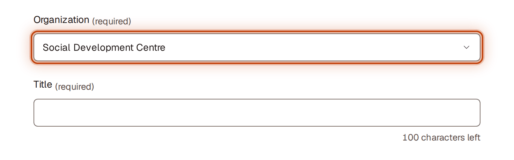
  <figcaption>Figure 3. Post for a partner</figcaption>
</figure>

1. Follow **Post a new opportunity**.
2. On the **Details** step, choose the partner in **Organization**.

The listing appears in that partner's portal as if they had posted it, and they can edit it. The panel shows who last updated it.

## Save a draft and finish it later

<figure>
  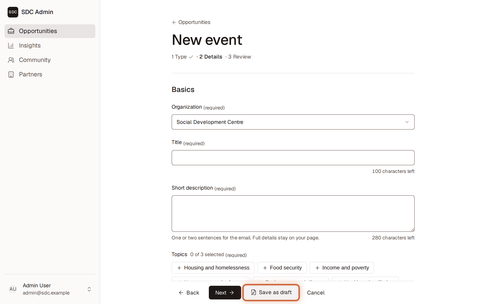
  <figcaption>Figure 4. Save a draft and finish it later</figcaption>
</figure>

1. In the form, fill in at least a **Title** (on the **Details** step).
2. Click **Save as draft**. It's there on every step.

The draft appears on the **Drafts** tab. Community members never see drafts. To finish it, open it from **Drafts**, click **Edit**, complete the fields and click **Publish**.

## Edit an opportunity

<figure>
  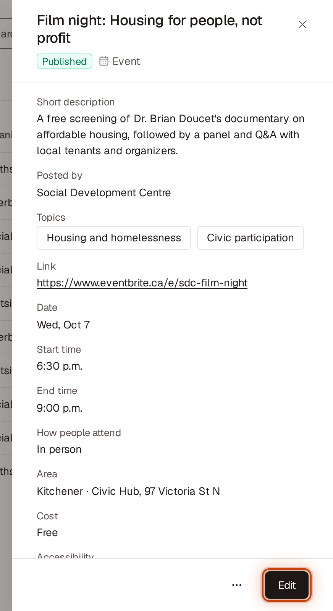
  <figcaption>Figure 5. Edit an opportunity</figcaption>
</figure>

1. Open the opportunity (click its row).
2. Click **Edit**.
3. Move through the steps with **Next** and make your changes, then click **Save changes** (on any step). For a draft, click **Publish** on the **Review** step, or **Save as draft**.

You'll see "Changes saved." Edits to a published listing show up in future emails; emails already sent can't be changed.

To leave without saving, click **Cancel**. Nothing you changed is kept.

You can't change an opportunity's type after it's created. To change it, post a new one and delete the old one.

## Post a repeat of an event (or any listing)

<figure>
  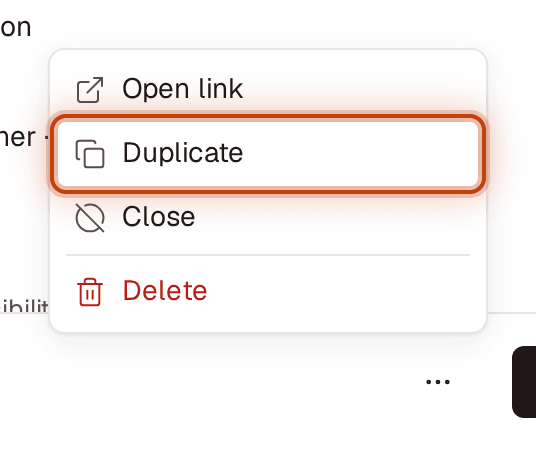
  <figcaption>Figure 6. Post a repeat of an event (or any listing)</figcaption>
</figure>

There's no repeat schedule. Copy the listing instead:
1. Open the opportunity.
2. Click **More actions** (⋯) and choose **Duplicate**.
3. The copy opens as a draft called "Copy of …". Change the title and date, then click **Publish**.

## Close an opportunity (full, cancelled or no longer needed)

<figure>
  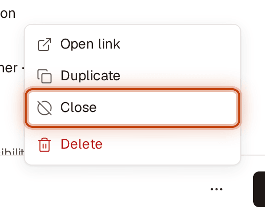
  <figcaption>Figure 7. Close an opportunity (full, cancelled or no longer needed)</figcaption>
</figure>

1. Open the opportunity.
2. Click **More actions** (⋯) and choose **Close**.

There's no confirmation. It moves to **Closed** and the record is kept. You'll see "Closed. This opportunity won't be recommended to members or included in emails."

Opportunities also close by themselves: an **event** at its start time, and anything else at the end of its deadline or apply-by day. These show **Ended**.

## Reopen a closed opportunity

<figure>
  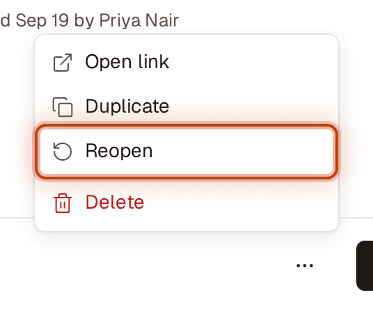
  <figcaption>Figure 8. Reopen a closed opportunity</figcaption>
</figure>

1. Go to **Closed** and open the opportunity.
2. Click **More actions** (⋯) and choose **Reopen**.

It goes back to **Published**. You'll see "Reopened. Members can see this opportunity again."

- If its date has already passed, you'll see "This event has already ended. Edit its date to reopen it." (or petition, and so on). Click **Edit**, choose a future date, click **Save changes**, then **Reopen** it.
- If it shows **Partner access removed**, you'll see "This partner no longer has access. Reinvite them before reopening their opportunities." See [When you remove a partner's access](#when-you-remove-a-partners-access).

## Delete an opportunity posted by mistake

<figure>
  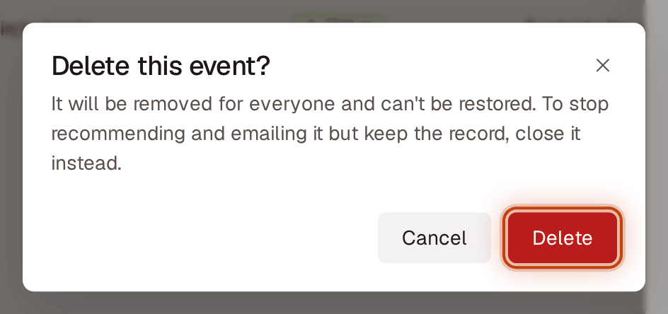
  <figcaption>Figure 9. Delete an opportunity posted by mistake</figcaption>
</figure>

1. Open the opportunity.
2. Click **More actions** (⋯) and choose **Delete**.
3. Read the confirmation and click **Delete**.

It's removed for everyone and can't be restored. You'll see "Deleted “{title}”." If you only want to stop it being recommended and emailed, **Close** it instead.

## Open the link people will use

<figure>
  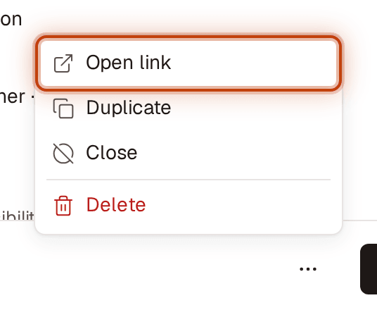
  <figcaption>Figure 10. Open the link people will use</figcaption>
</figure>

1. Open the opportunity.
2. Click **More actions** (⋯) and choose **Open link**. The page people go to opens, so you can check it works.

## See one partner's opportunities

<figure>
  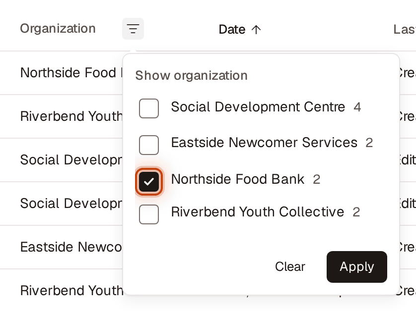
  <figcaption>Figure 11. See one partner's opportunities</figcaption>
</figure>

1. Go to **Opportunities**, click the filter icon next to **Organization** in the table header, and tick the partner.
2. Or, from **Partners**, open the partner and click **View opportunities**.

## What each type asks for
Required fields must be filled in to publish. Everything else is optional.

| Type | Section | Required | Optional |
|---|---|---|---|
| **Event** | **Date and place** | **Date**, **Start time**, **How people attend** (**In person**, **Online** or **Hybrid**), **Area** | **End time**, **Address or venue**, **Cost** (**Free** or **Paid**; if paid, **Cost details**), **Accessibility** (tick **Step-free access**, **Accessible washroom**, **ASL on request**, **Childcare**, **Quiet space**), **Accessibility note** |
| **Petition** | **Petition details** | **Addressed to** | **Deadline**, **Signature goal** |
| **Volunteer role** | **Role details** | **Time commitment** (**Under 2 hours a week**, **2–5 hours a week**, **5+ hours a week** or **One-time**), **Where volunteers work** (**In person**, **Remote** or **Hybrid**), **Area** | **Address or venue**, **Start date**, **Apply by**, **Skills** (choose any: **No experience needed**, **Driving**, **Languages**, **Tech**, **Childcare**, **Cooking**, **Writing**, **Event setup**), **Minimum age** |
| **Job** | **Job details** | **Employment type**, **Workplace** (**On-site**, **Remote** or **Hybrid**), **Area** | **Address or venue**, **Pay**, **Apply by**, **Qualifications** |
| **Other** (surveys, programs, calls for input) | **Details** | **Call to action**: the button people see, like "Take the survey" | **Deadline**, and up to 5 **Details**, each a **Label** and a **Value** (click **Add detail**) |

**Area** is one of **Kitchener**, **Waterloo**, **Cambridge**, **North Dumfries**, **Wellesley**, **Wilmot**, **Woolwich** or **Online / remote**. It's how SDC matches listings to members nearby. Choosing **Online** or **Remote** fills in **Online / remote** for you.

A **Deadline** or **Apply by** date closes the listing after that day. Leave it empty to keep the listing published until you close it.

## When you remove a partner's access
When you remove a partner's access (from **Partners**), its published opportunities move to **Closed** straight away and show **Partner access removed**. Members aren't recommended or emailed them any more.

If you reinvite the partner, nothing changes until someone there accepts the invitation. Then their opportunities that show **Partner access removed** reopen by themselves, as long as their dates haven't passed. Ones whose date passed show **Ended**, and ones someone closed stay closed.

## If something goes wrong
- **"Opportunity not found":** it was deleted. Click **Back to opportunities**.
- **"This opportunity no longer exists.":** someone else deleted it while you had it open. Go back to the list.
- **"Enter a web address, like sdckw.ca.":** check the **Link** for typos or spaces.
- **"This date has passed":** you can't publish with a past date. Choose a future date, or clear an optional deadline.
