# Partners

For SDC admins. Partners are organizations that share opportunities with SDC. Each has one or more people who can sign in to manage the organization's opportunities.

## Find an organization or a person

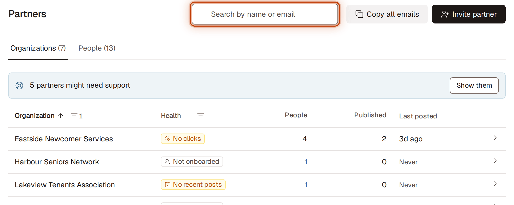

1. Go to **Partners**.
2. Choose a view: **Organizations** or **People**.
3. Type in **Search by name or email**. Results update as you type; press Enter to search right away, or click × to clear.
   - **Organizations** matches organization names and the names and emails of their people.
   - **People** matches names, emails and organization names.
   - The number beside each view shows how many match.
4. To narrow the list, click the filter icon next to a column heading and tick the options you want, then click **Apply**. The number beside each option shows how many rows it would show. To show everything in that column, click **Clear**, then **Apply**. Closing the filter without **Apply** keeps the list as it was.
   - **Organizations:** **Organization** filters by status (**Active** or **Removed**; you see **Active** unless you change it). **Health** filters by tag.
   - **People:** **Organization** filters by organization. **Tags** filters by invitation state; **Removed** is unticked at first, so removed people are hidden until you tick it.
5. To sort, click a column heading. Click it again to reverse the order.
6. On **Organizations**, click a row (or press Enter on it) to open its details on the right. The address bar now links to that organization, so you can copy the link to share it; closing the panel removes it from the link.
7. On **People**, rows don't open. Use the ⋯ menu at the end of a row (**Actions for {name}**) for that person, or click their organization's name to open that organization.

Long names, emails and organization names are cut short to keep each row on one line; point at one to see all of it.

If nothing matches, the page says so and offers **Clear search** or **Clear filters**.

## See which partners might need support

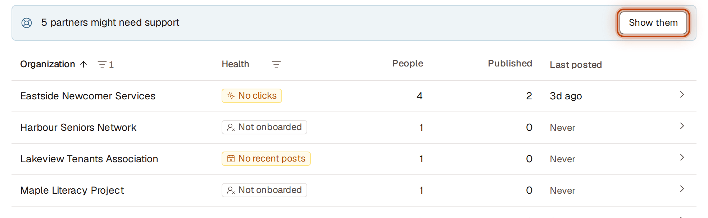

Each organization has at most one tag in the **Health** column:
- **Not onboarded**: nobody at the organization has accepted an invitation yet.
- **No recent posts**: no opportunity posted in the 60 days since they joined, or since their last post.
- **Not emailed**: one of their published opportunities wasn't in any email within 14 days of posting.
- **No clicks**: nobody has clicked their opportunities in SDC's emails.

1. Go to **Partners** > **Organizations**. If any organization has a tag, you'll see "{n} partners might need support" above the table.
2. Click **Show them** to list only those organizations (or use the **Health** filter).
3. Open an organization. Under **Health** you'll see why it's tagged and a **Suggested next step**.

## Copy partners' email addresses

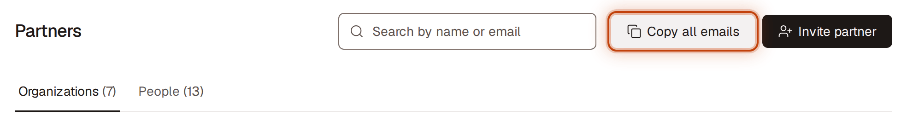

- **Everyone:** on **Partners**, click **Copy all emails** (top right). Every person who isn't removed is copied, separated by commas, ready to paste into your email's To or Bcc field. You'll see "Copied {n} email addresses".
- **One organization:** open it, click **More actions** (⋯) next to its name, and choose **Copy emails**.
- **One person:** on **People**, click their email address. A checkmark shows it was copied.

## Dismiss a "needs support" warning
If a partner is flagged (for example **No recent posts**) and you don't need to act:
1. Open the organization and click **Dismiss** in the warning under its numbers. The warning and its tag go away. They come back only if the organization's situation changes to a different warning.
2. To hide the "{n} partners might need support" banner above the list, click **Dismiss** on it. It stays hidden in this browser until the number of partners needing support changes.

## Keep notes about a partner

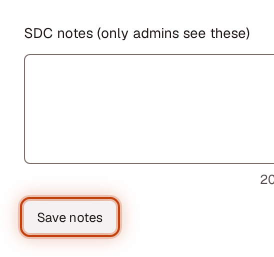

1. Open the organization.
2. Type in **SDC notes**. Notes save on their own when you stop typing or click away; you'll see **Saving…** then **Saved**.

Partners never see these notes. To delete them, clear the box.

## Post an opportunity for a partner

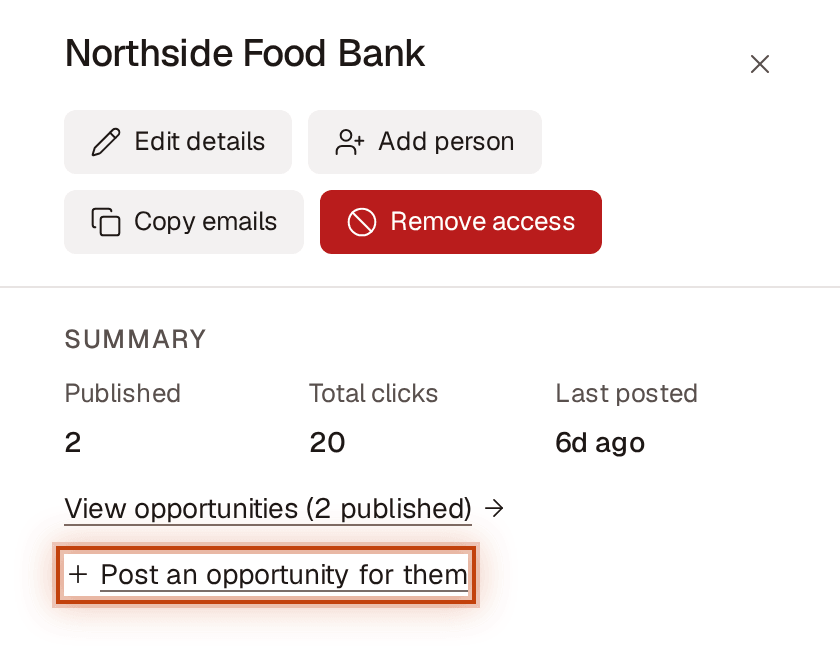

1. Open the organization.
2. Under **Summary**, click **Post an opportunity for them**.
3. New opportunity opens with that organization already chosen under **Organization**. Fill in the rest and publish as usual.

## Invite a person from a new or existing partner

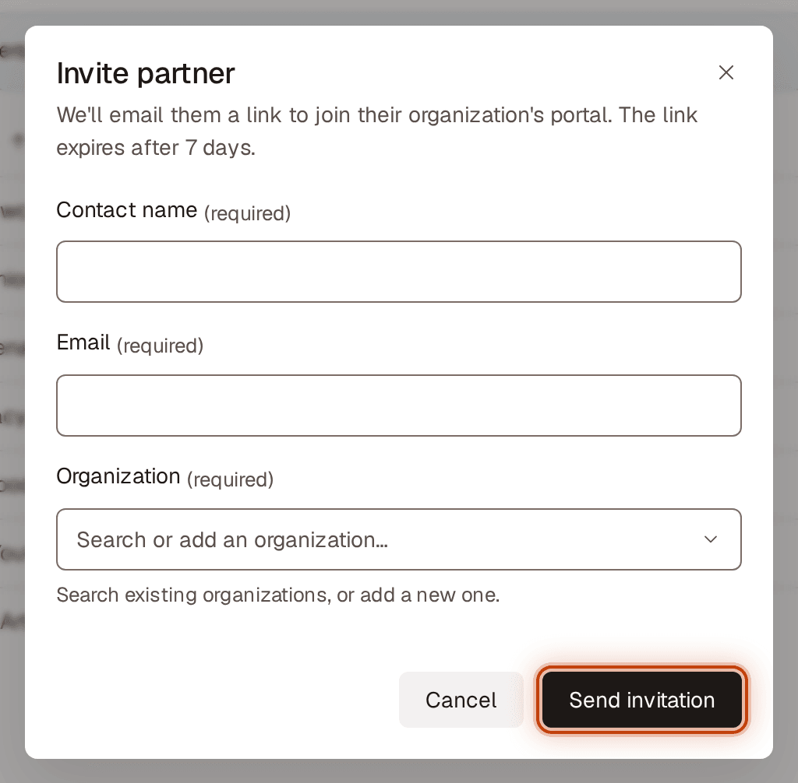

1. Go to **Partners** and click **Invite partner** (top right).
2. Enter their **Contact name** and **Email**.
3. Under **Organization**, start typing:
   - If the organization appears, choose it.
   - If it doesn't, choose **Add “<name you typed>” as a new organization**.
4. Click **Send invitation**.

You'll see "Invitation sent to {email}." They're listed on **People** as **Invitation pending** until they accept. The link works once, for 7 days.

**If something needs fixing,** the message shows under the field and what you typed stays. For example, "This person already has access to {organization}."

**If the email couldn't be sent,** you'll see "{name} was added, but we couldn't send the invitation. Select Retry to try again." They're listed as **Invitation not sent**. On **People**, open **Actions for {name}** (⋯) on their row and click **Retry**.

Every new organization starts this way, with its first person.

## Add another person to an existing partner

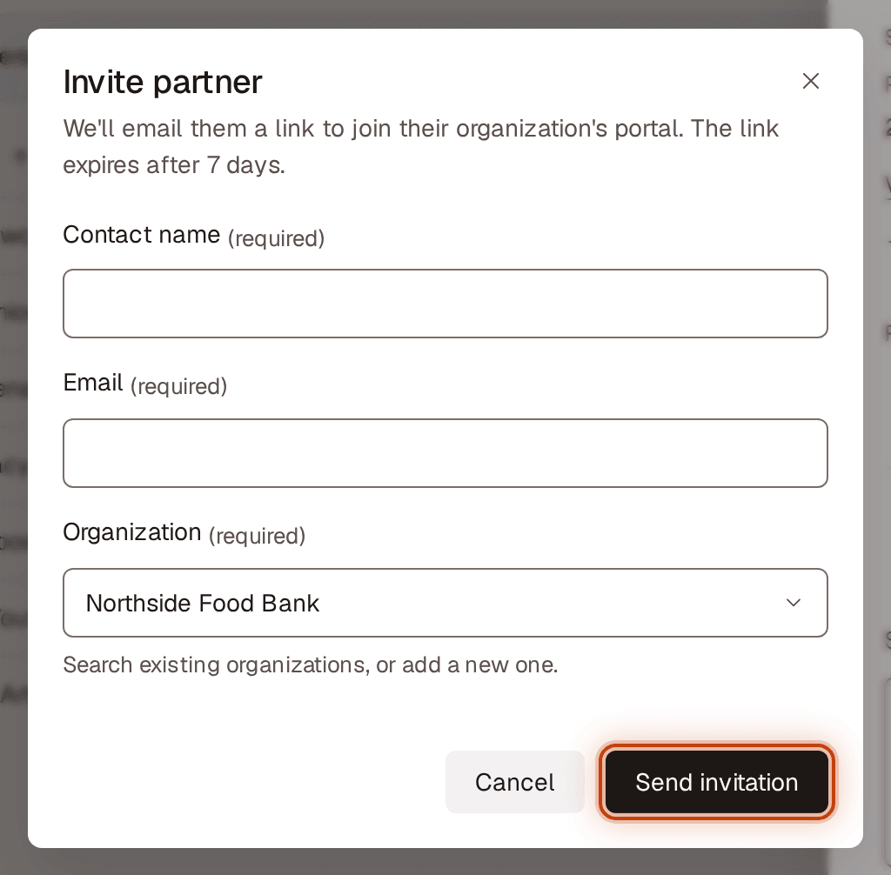

1. Open the organization (click its row).
2. Click **Add person** (next to **People** in the panel). The organization is already filled in.
3. Enter their **Contact name** and **Email** and click **Send invitation**.

## Resend, retry or cancel an invitation

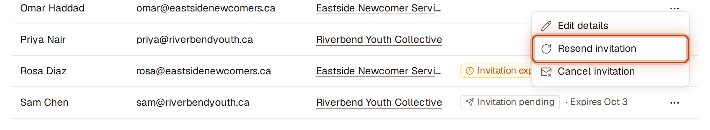

1. Go to **Partners** > **People** and click ⋯ (**Actions for {name}**) at the end of the person's row. The **Tags** column shows their invitation state and when it expires, for example "Invitation pending · Expires Oct 2".
2. Click:
   - **Resend invitation** (pending), **Send new invitation** (expired) or **Retry** (not sent). You'll see "New invitation sent to {email}. The previous link won't work." (or "Invitation sent to {email}." after a retry). If it can't be sent, nothing changes and an earlier link that still works keeps working.
   - **Cancel invitation**, then **Cancel invitation** in the confirmation, to delete the invitation and the person's entry. To keep it, click **Keep invitation**. If that was the organization's only person, the organization is deleted too (or, if it had access before, it goes back to **Removed**).

You can do the same from the organization's panel: find the person under **People** and open **Actions for {name}** (⋯).

## Edit a partner's details
1. Open the organization, click **More actions** (⋯) next to its name, and choose **Edit profile**.
2. Under **Profile**, change **Organization name**, **Website** (for example, sdckw.ca; you don't need to type https://) or **Short description**.
3. Click **Save changes**. You'll see "Changes saved." To stop without saving, click **Cancel**.

If something needs fixing, the message shows under the field and the cursor moves to it.

## Change a person's name or email

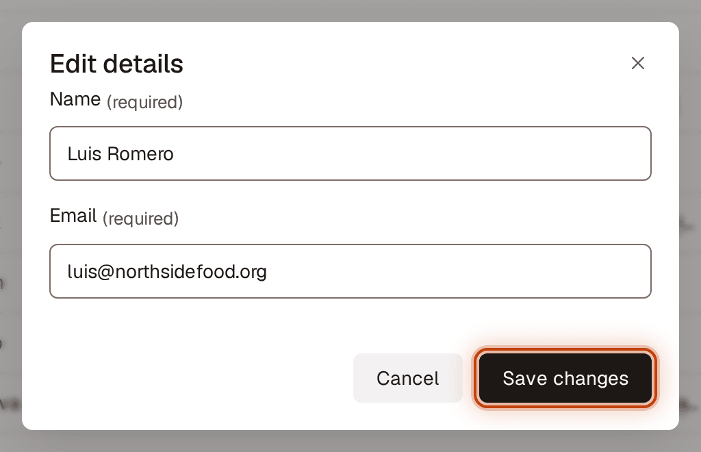

1. Go to **Partners** > **People** and click ⋯ (**Actions for {name}**) at the end of the person's row.
2. Click **Edit details**.
3. Change **Name** or **Email**, then click **Save changes**. To stop without saving, click **Cancel**.

Changing someone's email sends a new invitation to the new address. If they already had access, they keep it; once they accept, they sign in with the new email. If the invitation can't be sent, nothing is saved: "We couldn't send the invitation. Try again."

## See a partner's opportunities

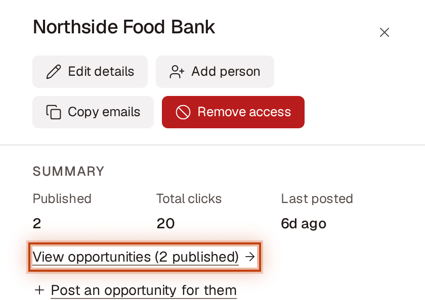

1. Open the organization. **Summary** shows how many opportunities are **Published**, their **Total clicks** from SDC's emails, and when they **Last posted**.
2. Click **View opportunities**. The Opportunities list opens filtered to that partner.

## Remove a person who left a partner organization

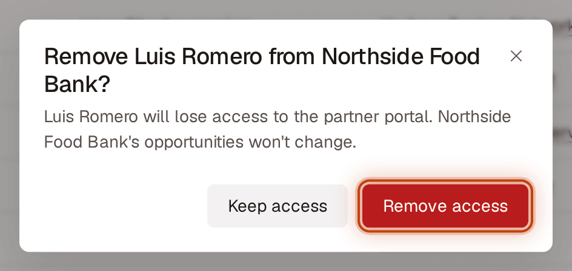

1. Go to **Partners** > **People** and click ⋯ (**Actions for {name}**) at the end of the person's row (or open the organization and use **Actions for {name}** there).
2. Click **Remove from organization**, then **Remove access**. To keep their access, click **Keep access**.

You'll see "{name} was removed from {organization}. They no longer have access." They're tagged **Removed** on **People** (tick **Removed** in the **Tags** filter to see them). Their email can be invited again, here or under another organization.

An organization always has at least one person. You can't remove the only person with access to an organization; remove the organization's access instead. You can't remove someone who hasn't accepted yet; cancel their invitation instead.

## Move a person to a different partner

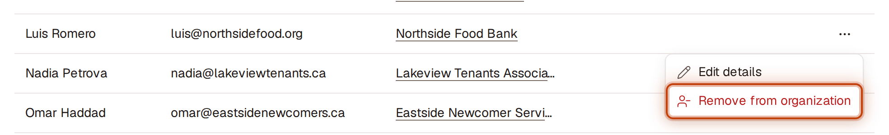

1. Remove them from their current organization (see above).
2. Invite their email under the new organization (see **Invite a person**).

## Remove a partner's access (the partnership ended or the organization dissolved)
1. Open the organization, click **More actions** (⋯) next to its name, and choose **Remove access**.
2. Read the confirmation and click **Remove access**. To cancel, click **Keep access**.

What happens right away:
- Everyone at that organization loses access to the partner portal.
- Its opportunities are closed (**Closed**, reason **Partner access removed**) and aren't recommended or emailed.
- Emails already sent can't be recalled, and links to the partner's own registration pages may keep working.

You'll see "{organization} no longer has access. Its opportunities are closed." The organization is now **Removed**: tick **Removed** in the **Organization** column's filter to see it and its details.

## Bring back a removed partner or person

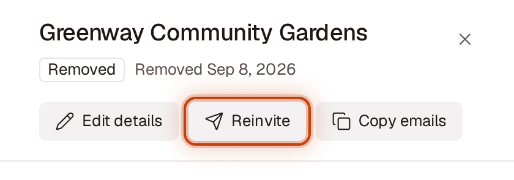

**An organization:**
1. Go to **Partners**, tick **Removed** in the **Organization** column's filter, and open the organization.
2. Click **Reinvite**, enter the **Contact name** and **Email** of the person to invite, and click **Send invitation**.

You'll see "Invitation sent to {email}. {organization} is awaiting a response." The organization returns to **Active** tagged **Not onboarded**. Nobody has access until the person accepts; when they do, its closed opportunities whose dates haven't passed reopen automatically. Its other people stay under **Removed**; invite them again as needed.

**A person:**
1. Go to **Partners** > **People**, tick **Removed** in the **Tags** filter, and click ⋯ (**Actions for {name}**) at the end of the person's row.
2. Click **Invite again**. Their name, email and organization are filled in; change anything that's different and click **Send invitation**.
