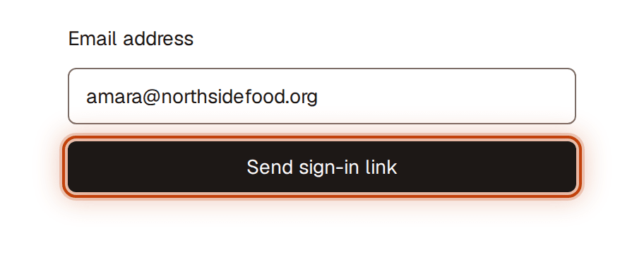
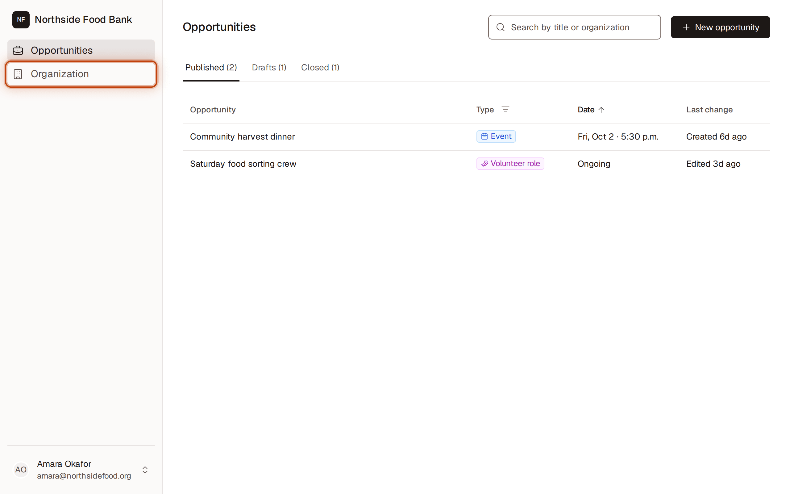
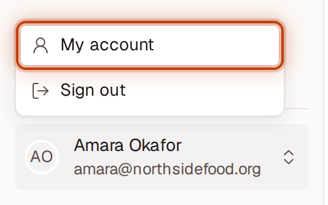
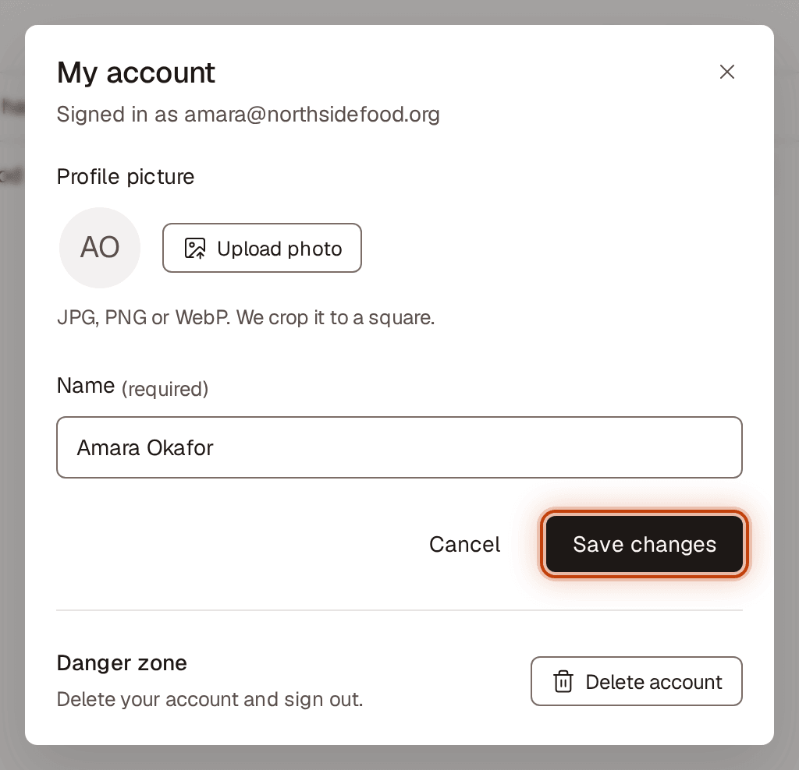
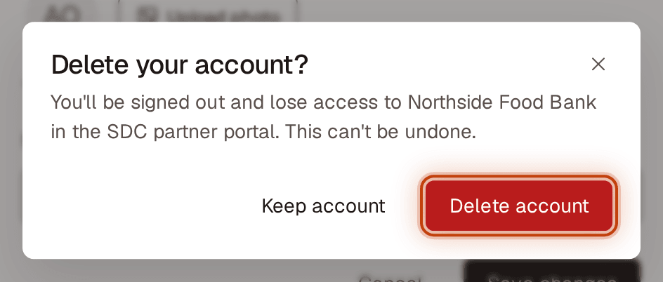
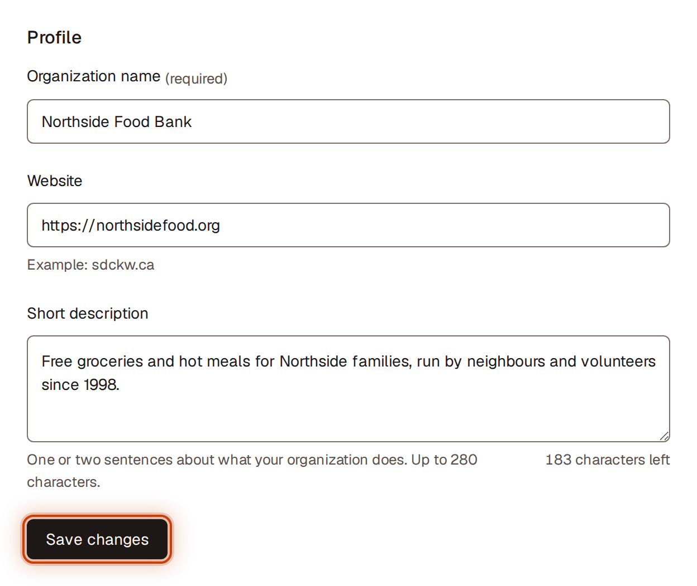
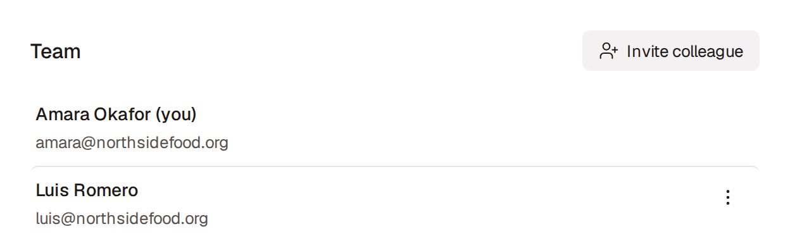
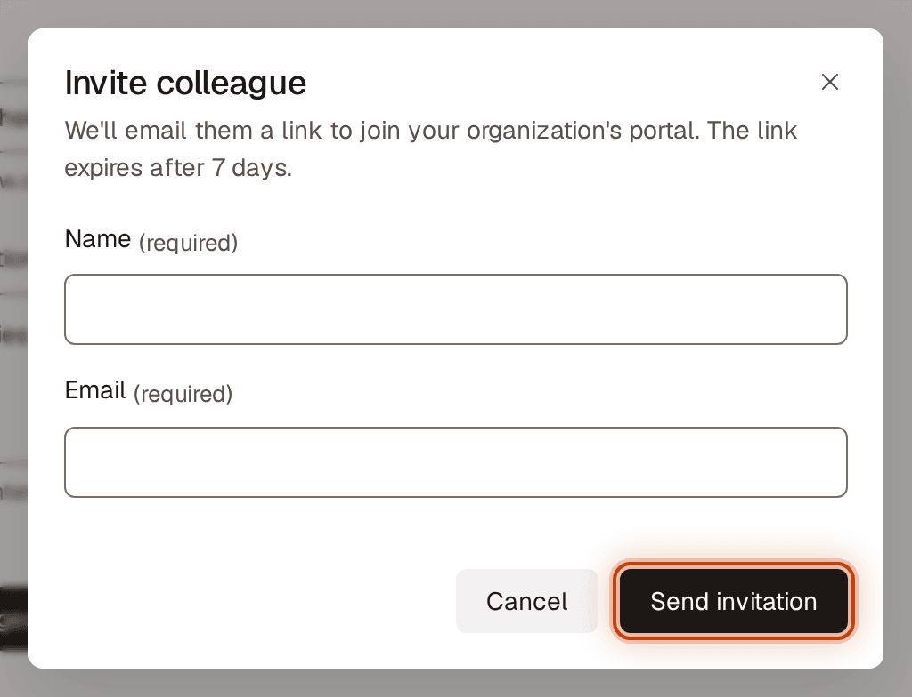
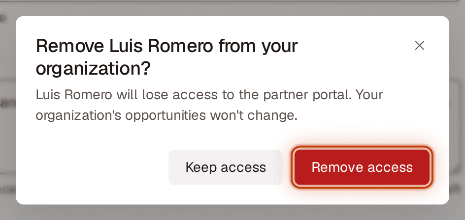

# Getting started with the partner portal

For Civic Hub partners. The partner portal is where your organization posts opportunities for the SDC community and keeps its details up to date. There's no public sign-up; SDC or a colleague at your organization invites you.

## Accept your invitation
1. Open the invitation email from SDC.
2. Click the link in the email. You're signed in and taken to your organization's portal.

The link works once, for 7 days. **If it has expired or doesn't work,** ask your SDC contact to resend it. Resending sends a new link, and the old one stops working.

## Sign in later

<figure>
  
  <figcaption>Figure 1. Sign in later</figcaption>
</figure>

There's no password. You sign in with a link sent to your email.
1. Go to the sign-in page and enter your **Email**.
2. Click **Send sign-in link**.
3. Open the email and click the link.

You'll see "Check your email for a sign-in link." after step 2. Use the same email address SDC invited. If no email arrives, check your spam folder, then ask your SDC contact to check which address they invited.

## Get around the portal

<figure>
  
  <figcaption>Figure 2. Get around the portal</figcaption>
</figure>

The sidebar on the left shows your organization's name at the top, and two sections:
- **Opportunities:** post and manage your events, petitions, volunteer roles, jobs and other asks. See [Partner portal: opportunities](./partner-opportunities.md).
- **Organization:** your organization's details and who on your team has access.

The section you're in is highlighted. On a phone, tap the menu button (**Open menu**) at the top left to open the sidebar, then choose a section. To close it without choosing, tap the **X** (**Close menu**), tap the dimmed page beside it, or press Escape.

## Go to your account or sign out

<figure>
  
  <figcaption>Figure 3. Go to your account or sign out</figcaption>
</figure>

1. Click your name at the bottom of the sidebar.
2. Choose **My account** to change your name or profile picture, or **Sign out**.

When you sign out, you go back to the sign-in page, which says **You're signed out. See you soon.**

## Change your name or profile picture

<figure>
  
  <figcaption>Figure 4. Change your name or profile picture</figcaption>
</figure>

1. Click your name at the bottom of the sidebar, then choose **My account**.
2. To add or change your picture, click **Upload photo** (or **Change photo**) and choose a JPG, PNG or WebP image. It's cropped to a square. To go back to your initials, click **Remove photo**.
3. Edit **Name**.
4. Click **Save changes**. You'll see **Changes saved**.

Your email address can't be changed here yet.

## Delete your account

<figure>
  
  <figcaption>Figure 5. Delete your account</figcaption>
</figure>

1. Click your name at the bottom of the sidebar, then choose **My account**.
2. Under **Danger zone**, click **Delete account**.
3. Click **Delete account** again to confirm, or **Keep account** to go back.

You're signed out and lose access right away. This can't be undone.

## Update your organization's details

<figure>
  
  <figcaption>Figure 6. Update your organization's details</figcaption>
</figure>

Keep these current. Your organization's name appears on every opportunity you post.
1. Go to **Organization**.
2. Under **Profile**, change any of:
   - **Organization name:** as the community knows it. Required.
   - **Website:** your main web address, for example sdckw.ca. You don't need to type https://.
   - **Short description:** one or two sentences about what your organization does, up to 280 characters.
3. Click **Save changes**.

You'll see "Changes saved." The new name shows up in the sidebar and on all your opportunities, including ones already published. Emails that already went out keep the old name.

**If something needs fixing,** a message shows under the field, what you typed stays, and the cursor moves to the first field to fix. For example, "Another organization already has this name." or "Enter a valid website, like sdckw.ca." SDC can also edit these details for you.

## See who on your team has access

<figure>
  
  <figcaption>Figure 7. See who on your team has access</figcaption>
</figure>

1. Go to **Organization**.
2. Under **Team**, you'll see everyone at your organization who can use the portal or has been invited. Your own row is marked **(you)**. Anyone who hasn't accepted yet shows one of:
   - **Invitation pending** and the date it expires: the email arrived and the link still works.
   - **Invitation not sent**: the email couldn't be delivered. Click **Retry**, or check the address.
   - **Invitation expired** and the date it expired: the link no longer works. Send a new one.

## Invite a colleague

<figure>
  
  <figcaption>Figure 8. Invite a colleague</figcaption>
</figure>

1. Go to **Organization**.
2. Under **Team**, click **Invite colleague**.
3. Enter their **Name** and **Email**.
4. Click **Send invitation**.

You'll see "Invitation sent to {email}." They appear under **Team** as **Invitation pending** until they accept. The link in their email works once, for 7 days.

**If something needs fixing,** the dialog stays open, a message shows under the field, and what you typed stays. For example, "This person already has access to your organization."

**If the email couldn't be sent:**
- If they were added, you'll see "{name} was added, but we couldn't send the invitation. Select Retry to try again." Their row shows **Invitation not sent** with **Retry**. If the address is wrong, cancel the invitation and invite them again.
- If they weren't added, the dialog stays open with what you typed and says "We couldn't send the invitation. Try again."

## Resend or cancel an invitation
1. Go to **Organization**.
2. Under **Team**, click **Actions for {name}** (⋯) on the person's row.
3. Choose:
   - **Resend invitation** (pending), **Send new invitation** (expired) or **Retry** (not sent). You'll see "New invitation sent to {email}. The previous link won't work." If it can't be sent, you'll see "We couldn't send the new invitation. Try again." and a link they already have keeps working.
   - **Cancel invitation**, then **Cancel invitation** in the confirmation, if you invited the wrong person or address. You'll see "Invitation cancelled." To keep it, click **Keep invitation**.

## Remove someone who has left

<figure>
  
  <figcaption>Figure 9. Remove someone who has left</figcaption>
</figure>

1. Go to **Organization**.
2. Under **Team**, click **Actions for {name}** (⋯) on the person's row.
3. Choose **Remove from organization**.
4. Click **Remove access**. To keep their access, click **Keep access**.

You'll see "{name} was removed from {organization}. They no longer have access." Your organization's opportunities don't change, including ones they posted.

You can't remove yourself; there's no menu on your own row. Ask a colleague or SDC. You also can't remove the only person with access to your organization; contact SDC for help.

## If you can't get in
- **"You've been signed out. Sign in again to save your changes."** Nothing was saved. Click **Sign in**, then redo your change.
- **"Your organization no longer has access. Contact SDC if you think this is a mistake."** Nothing was saved. The message shows SDC's contact email.
- **You were removed from your organization, or your organization's access ended:** the portal sends you back to the sign-in page. Contact SDC if you think this is a mistake.
- **You changed jobs within your organization and have a new email:** ask SDC to update your email. They'll send a new invitation to the new address.
