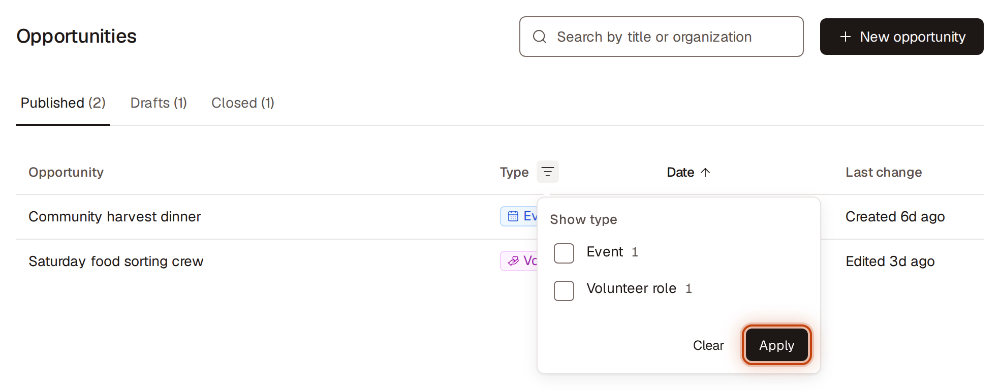
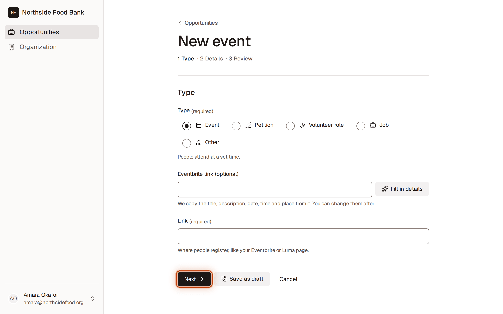
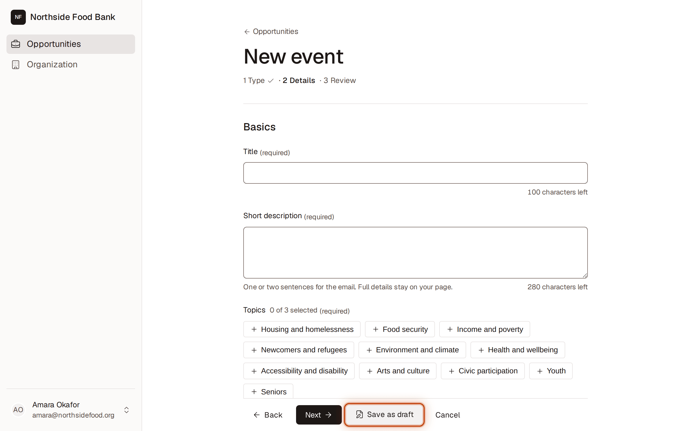
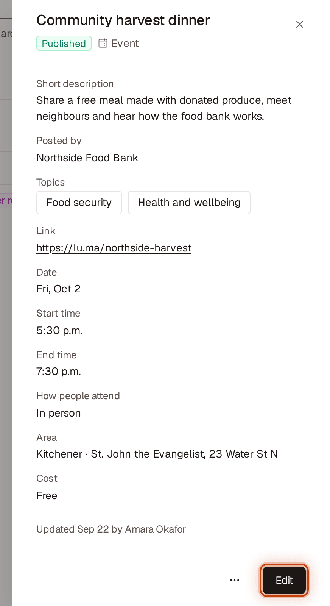
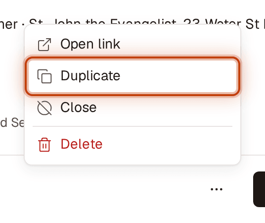
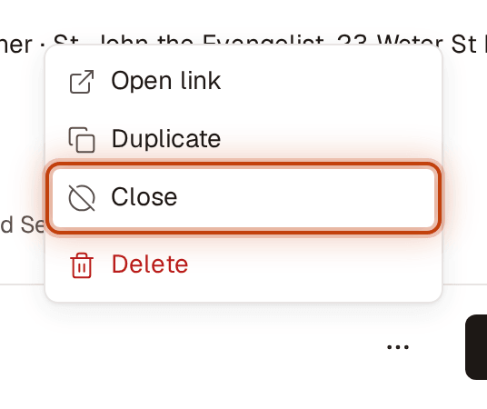
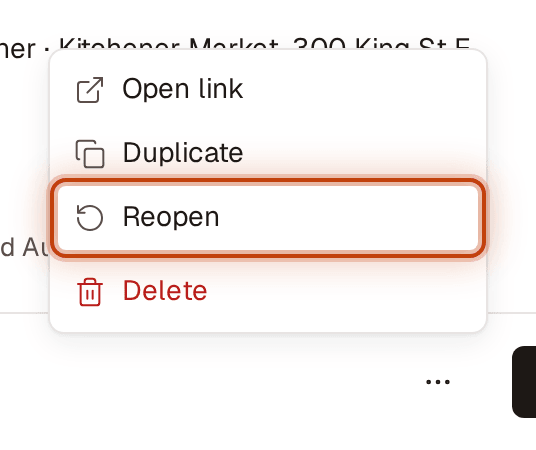
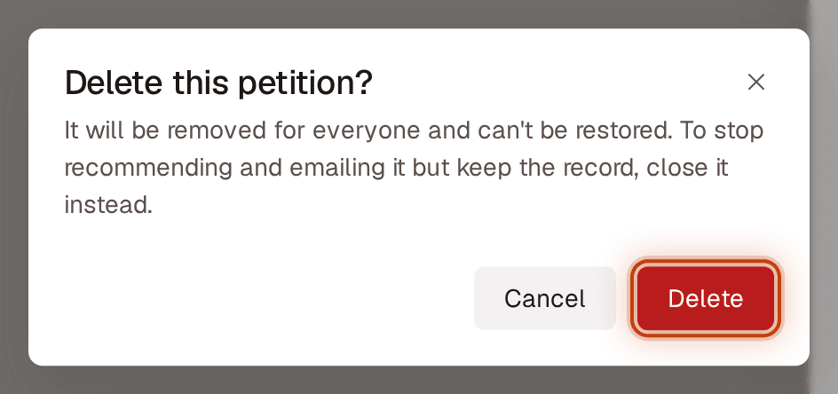
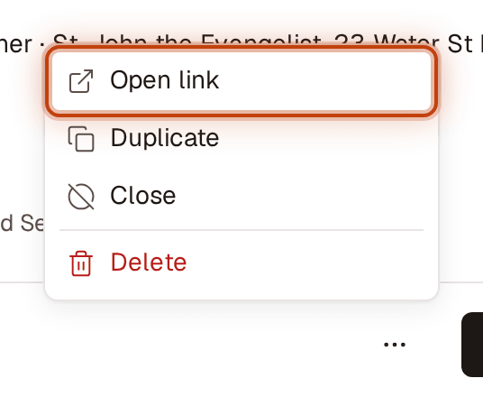

# Partner portal: opportunities

For Civic Hub partners. Share your events, petitions, volunteer roles, jobs and other asks with the SDC community. SDC sends each one by email to people who care about its topics. People take part on your own page (Eventbrite, Luma, Google Forms, your website), so keep using the tools you already have.

You only see your own organization's opportunities. Anyone at your organization who has access can edit them, and so can SDC staff.

New here? Start with [Getting started with the partner portal](./partner-getting-started.md).

## Find your opportunities

1. Go to **Opportunities** in the sidebar.
2. Choose a tab:
   - **Published:** members can see it now. Sorted by date, soonest first.
   - **Drafts:** not published yet. Only people at your organization, and SDC, see drafts. Most recently updated first.
   - **Closed:** members aren't recommended or emailed it. Each one shows why: **Ended** (its date passed) or **Closed** (someone closed it). Most recently updated first.
3. To narrow the list, type in the search box at the top of the page (results update as you type). To filter by type, click the filter icon next to **Type** in the table header (**Filter Type**), tick one or more types and click **Apply**. To remove it, open it, click **Clear**, then **Apply**.
4. To sort, click a column header: **Opportunity**, **Date** or **Last change**. Click it again to reverse the order. **Last change** reads "Created …" or "Edited …". Point at a title that ends in "…" to see all of it.
5. Click a row to see its details on the right. To share it with a colleague, copy the page address: it opens with the same details panel open.

If nothing matches, you'll see **No matches**. Click **Clear filters** to start over.

## Post an opportunity

It takes about two minutes. Have your link ready. The form has three steps, shown at the top: **1 Type · 2 Details · 3 Review**. Click **Next** and **Back** to move between them, and **Save as draft** on any step.

1. Go to **Opportunities** and click **New opportunity** (top right).
2. **Type:** choose what you're posting: **Event**, **Petition**, **Volunteer role**, **Job** or **Other** (for surveys, programs and calls for input).
   - **Is your event on Eventbrite?** Paste its address into **Eventbrite link (optional)** and click **Fill in details**. We fill in the title, short description, date, times and place, and use the Eventbrite page as your **Link**. Check them on the next step.
   - **Link:** your page where people take part, like `yourorg.ca/events`. You don't need to type `https://`.
3. Click **Next**.
4. **Details:**
   - **Title:** say what it is in a few words. This is the email headline.
   - **Short description:** one or two sentences for the email. Full details stay on your page.
   - **Topics:** choose up to 3. The count beside **Topics** shows how many you've chosen; at 3, unselect one to choose another.
   - Fill in the section for your type (see [What each type asks for](#what-each-type-asks-for)).
5. Click **Next**.
6. **Review:** this is how your listing looks in members' emails. Click **Edit type and link** or **Edit details** to change something.
7. Click **Publish**.

It's published right away. You'll see "Published. Members can now see this event." (or petition, volunteer role, and so on).

**If something is missing or wrong,** the form opens the step with the first problem. A box at the top lists each problem, for example "Fix 2 fields to publish this event", and the cursor moves to the first field to fix. Click a problem in the box to jump to its field, even on another step. What you typed is kept.

## Save a draft and finish it later

Not ready to publish? For example, you don't have the registration link yet.
1. Fill in at least a **Title**.
2. Click **Save as draft**.

Your draft is on the **Drafts** tab. The community doesn't see it. When you're ready, open it, click **Edit**, fill in the rest and click **Publish**.

## Change an opportunity

1. Open the opportunity (click its row).
2. Click **Edit**.
3. Move through the steps with **Next** and make your changes, then click **Save changes** (on any step). For a draft, click **Publish** on the **Review** step, or **Save as draft**.

You'll see "Changes saved." Emails that already went out can't be changed.

To leave without saving, click **Cancel**. Nothing you changed is kept.

## Post the same event again

1. Open the event.
2. Click **More actions** (⋯) and choose **Duplicate**.
3. A copy opens as a draft called "Copy of …". Change the title and date, then click **Publish**.

## Close an opportunity (it's full, cancelled or filled)

1. Open the opportunity.
2. Click **More actions** (⋯) and choose **Close**.

There's no confirmation. It moves to **Closed**. You'll see "Closed. This opportunity won't be recommended to members or included in emails."

You don't need to close things when their date passes. An **event** closes by itself at its start time. Anything with a **Deadline** or **Apply by** date closes at the end of that day. These show **Ended**.

## Reopen an opportunity

1. Go to **Closed** and open the opportunity.
2. Click **More actions** (⋯) and choose **Reopen**.

It's back on **Published**. You'll see "Reopened. Members can see this opportunity again." If its date has passed, you'll see "This event has already ended. Edit its date to reopen it." Click **Edit**, choose a new date, click **Save changes**, then **Reopen** it.

## Delete an opportunity you posted by mistake

1. Open the opportunity.
2. Click **More actions** (⋯) and choose **Delete**.
3. Click **Delete** to confirm.

It's gone for good. You'll see "Deleted “{title}”." If it was real but is now full or cancelled, **Close** it instead so SDC keeps the record.

## Check your link

1. Open the opportunity.
2. Click **More actions** (⋯) and choose **Open link**. This is the page people will land on.

## What each type asks for
You need the required fields to publish. Everything else is optional; leave it blank if you're not sure.

| Type | Section | Required | Optional |
|---|---|---|---|
| **Event** | **Date and place** | **Date**, **Start time**, **How people attend** (**In person**, **Online** or **Hybrid**), **Area** | **End time**, **Address or venue**, **Cost** (**Free** or **Paid**; if paid, **Cost details**), **Accessibility** (tick **Step-free access**, **Accessible washroom**, **ASL on request**, **Childcare**, **Quiet space**), **Accessibility note** |
| **Petition** | **Petition details** | **Addressed to** | **Deadline**, **Signature goal** |
| **Volunteer role** | **Role details** | **Time commitment** (**Under 2 hours a week**, **2–5 hours a week**, **5+ hours a week** or **One-time**), **Where volunteers work** (**In person**, **Remote** or **Hybrid**), **Area** | **Address or venue**, **Start date**, **Apply by**, **Skills** (choose any: **No experience needed**, **Driving**, **Languages**, **Tech**, **Childcare**, **Cooking**, **Writing**, **Event setup**), **Minimum age** |
| **Job** | **Job details** | **Employment type**, **Workplace** (**On-site**, **Remote** or **Hybrid**), **Area** | **Address or venue**, **Pay**, **Apply by**, **Qualifications** |
| **Other** | **Details** | **Call to action**: the button people see, like "Take the survey" | **Deadline**, and up to 5 **Details**, each a **Label** and a **Value** (click **Add detail**) |

**Area** is one of **Kitchener**, **Waterloo**, **Cambridge**, **North Dumfries**, **Wellesley**, **Wilmot**, **Woolwich** or **Online / remote**. SDC uses it to send your listing to people nearby. Choosing **Online** or **Remote** fills in **Online / remote** for you.

## If something goes wrong
- **"Opportunity not found":** it was deleted, or it belongs to another organization. Click **Back to opportunities**.
- **"This opportunity no longer exists.":** someone deleted it while you had it open. Go back to the list.
- **"Enter a web address, like sdckw.ca.":** check the **Link** for typos or spaces.
- **"This date has passed":** you can't publish with a past date. Choose a future date, or clear an optional deadline.
- **You need help, or something looks wrong:** contact your SDC Civic Hub coordinator.
